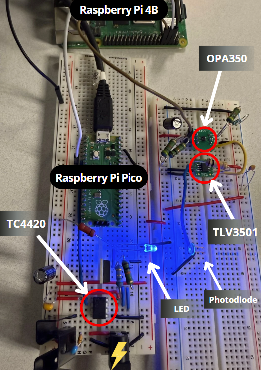

# Secure and Robust Li-Fi Communication for Embedded Systems

This project implements a secure, real-time Li-Fi communication channel between a Raspberry Pi Pico and a host computer. It is designed to be a robust and production-ready embedded system, featuring strong cryptography, persistent key storage, and a rich command interface for easy management.

---

## Project Overview

This repository contains the embedded software for a secure Li-Fi transmitter (the Pico) and the necessary host-side components to manage it. The system is designed to showcase a secure communication workflow example, from initial key provisioning to real-time encrypted messaging.

-   **Sender (Raspberry Pi Pico)**: A powerful Li-Fi transmitter that encrypts messages using a persistent session key with AES-128-GCM. It operates autonomously and can be managed remotely via a command interface.
-   **Receiver/Controller (Host)**: A host system (like a Raspberry Pi 4 or a PC) is responsible for the initial provisioning of the session key and can be used to receive and decrypt the Li-Fi messages.

<div style="text-align:center;">
  <table style="width:100%; max-width:1100px; margin:0 auto; border-collapse:collapse; border:none;">
    <tr>
      <td style="width:80%; vertical-align:top; padding:0; border:none;">
        <a href="./img/physical_lifi.png">
          
        </a>
      </td>
      <td style="width:20%; vertical-align:top; padding:0; border:none;">
        <h2 style="margin:0 0 .75rem 0;">Hardware Overview</h2>
        <div style="padding-left:10px; box-sizing:border-box; text-align:right;">
          <p><strong>Raspberry Pi Pico</strong><br>
          <em>Purpose:</em> LiFi sender (UART + AES-GCM encryption)<br>
          <em>Connections:</em> LED driver, UART to Pi 4<br>
          <em>Notes:</em> Dual-slot session key caching</p>
          <p><strong>Raspberry Pi 4</strong><br>
          <em>Purpose:</em> LiFi receiver + SST Auth client<br>
          <em>Connections:</em> Photodiode, UART to Pico<br>
          <em>Notes:</em> Fetches and sends session keys</p>
          <p><strong>TC4420 → LED Driver</strong><br>
          <em>Role:</em> Drives high-speed LED modulation<br>
          <em>Supply:</em> 12V DC<br>
          <em>Notes:</em> Fast rise/fall times for LiFi</p>
          <p><strong>OP350 ← Photodiode</strong><br>
          <em>Role:</em> Detects modulated light from LED<br>
          <em>Biasing/Drive:</em> Reverse-biased for speed<br>
          <em>Notes:</em> Feeds comparator input</p>
          <p><strong>TLV3501 Comparator</strong><br>
          <em>Role:</em> Converts analog photodiode signal to digital<br>
          <em>Threshold/Ref:</em> Tuned for reliable detection<br>
          <em>Notes:</em> Low propagation delay</p>
          <p><strong>12V DC ⚡ to Breadboard</strong><br>
          <em>Purpose:</em> Power LED driver circuit<br>
          <em>Notes:</em> Feeds TC4420 module</p>
        </div>
      </td>
    </tr>
  </table>
</div>

## Hardware Requirements

### **Sender (Pico)**
- [Raspberry Pi Pico (RP2040)](https://www.sparkfun.com/raspberry-pi-pico.html?src=raspberrypi)
- Li-Fi LED transmitter module
- USB cable (for programming and debug serial)

### **Receiver (Pi 4)**
- [Raspberry Pi 4 Model B (4 GB)](https://www.sparkfun.com/raspberry-pi-4-model-b-4-gb.html?src=raspberrypi)
- Li-Fi receiver module

---

## 📖 Pinout References

For full details on the board headers:

* **Raspberry Pi Pico (RP2040)** → [Pico Pinout (official PDF)](https://datasheets.raspberrypi.com/pico/Pico-R3-A4-Pinout.pdf)
* **Raspberry Pi 4 (40-pin header)** → [Pi 4 GPIO Pinout (pinout.xyz)](https://pinout.xyz/pinout/pin8_gpio14#)

---

## 🔌 UART1 Wiring (Pico ↔ Pi 4)

| Function     | Pico Pin (RP2040) | Pi 4 Header Pin | Pi 4 GPIO | Notes                      |
| ------------ | ----------------- | --------------- | --------- | -------------------------- |
| **UART1 TX** | GPIO4 (Pin 6)     | Pin 10          | GPIO15 RX | Pico sends → Pi 4 receives |
| **UART1 RX** | GPIO5 (Pin 7)     | Pin 8           | GPIO14 TX | Pico receives ← Pi 4 sends |
| **Ground**   | GND (Pin 38)      | Pin 6           | GND       | Common ground required     |

> ⚠️ TX ↔ RX must cross: Pico TX → Pi RX, Pico RX ← Pi TX.
#### TX = Transmit: The pin that sends data. 
#### RX = Receive: The pin that receives data.
#### Should not be RX -> RX only TX -> RX or RX -> TX
---

## ⚙️ Pico Firmware Setup (update)

```c
#define UART_ID uart1  // Use hardware UART1 (separate from USB debug/stdio)
#define UART_TX_PIN 4 // GPIO4 → TX line for Pico → Pi4 (sending data out)
#define UART_RX_PIN 5 // GPIO5 → RX line for Pico ← Pi4 (receiving session keys)
#define BAUD_RATE 1000000 // 1 Mbps for high-throughput, low-latency key exchange

uart_init(UART_ID, BAUD_RATE);
// Map the chosen GPIO pins to the UART hardware.
gpio_set_function(UART_TX_PIN, GPIO_FUNC_UART);
gpio_set_function(UART_RX_PIN, GPIO_FUNC_UART);
// Allowing the pico to retrieve the session key over UART.
```

---

## ⚙️ Raspberry Pi 4 Setup (update)

1. Enable UART in `/boot/config.txt`:

   ```ini
   enable_uart=1
   ```
2. Reboot, then check:

   ```bash
   ls -l /dev/serial0
   ```

   It should link to `/dev/ttyAMA0` or `/dev/ttyS0`.
3. Open the port at 1 Mbps:

   ```bash
   # Configure 1M Baud rate and interface to type messages to send on pico
   stty -F /dev/serial0 1000000 # setting to 1M Baud matches pico's firmware -> #define BAUD_RATE 1000000
   screen /dev/serial0 1000000 # setting pico CMD interface so you can type commands like CMD: new key, CMD: print key sender, etc. directly into the Pico.
   ```
   ---

## Key Features:

- **Authenticated Encryption:**  
&nbsp;&nbsp;&nbsp;&nbsp;Utilizes **AES-128-GCM** for state-of-the-art encryption and message authentication, protecting against both eavesdropping and tampering.

- **Robust Key Persistence:**  
&nbsp;&nbsp;&nbsp;&nbsp;Implements a redundant **A/B slot system** in the Pico's flash memory to ensure the session key survives reboots and power loss. The system automatically falls back to a valid key if one slot is corrupted.

- **Secure Key Provisioning:**  
&nbsp;&nbsp;&nbsp;&nbsp;On first boot/empty slot, listens on **UART1** with preamble 0xAB 0xCD to receive the session key (e.g., from the Pi 4/auth client). Supports `new key` and `new key -f` for controlled overwrite.

- **Watchdog Timer:**  
&nbsp;&nbsp;&nbsp;&nbsp;The Pico (sender) is monitored by a hardware watchdog that automatically reboots the device if it becomes unresponsive, ensuring high availability.

- **Secure Memory Handling:**  
&nbsp;&nbsp;&nbsp;&nbsp;Sensitive data like keys, nonces, and ciphertext are securely zeroed from memory after use with `secure_zero()` to limit in-RAM exposure.

- **Interactive Command Interface:**  
&nbsp;&nbsp;&nbsp;&nbsp;A rich set of commands allows for real-time management of the device, including key management, slot status checks, and diagnostics.

- **Modular & Reusable Code:**  
&nbsp;&nbsp;&nbsp;&nbsp;The project is built with a modular architecture, separating hardware-specific logic (`pico_handler`), command processing (`cmd_handler`), and the main application logic for maximum reusability and maintainability.

- **Cryptographically Secure PRNG:**  
&nbsp;&nbsp;&nbsp;&nbsp;mbedTLS CTR_DRBG seeded from the RP2040 ring-oscillator via `pico_hardware_entropy_poll()` → high-quality randomness for salts and other needs.
---

---

## Software Dependencies

-   CMake ≥ 3.13
-   ARM GCC Toolchain
-   in deps/ for you (git submodule update --init --recursive --progress)
- -   (Pico Sender) [Pico SDK](https://github.com/raspberrypi/pico-sdk)
- -   (Pi4 Receiver) [iotauth](https://github.com/iotauth/iotauth) project for advanced key provisioning.

---

## Project Architecture

The code is organized into a modular structure:

-   `src/`: Core logic, including the command handler (`cmd_handler.c`) and Pico-specific/Pi-4 specific functions (`pico_handler.c`)/(`pi_handler.c`).
- - `note`: `pi_handler.c` is under construction - waiting for TPM module
-   `include/`: Header files defining the public interface for each module.
-   `sender/src/`: The main application firmware (`lifi_flash.c`) for the Pico transmitter.
-   `lib/`: External libraries, including `mbedtls`, `pico-sdk`, and `picotool`.
-   `deps/`: required repositories for session key including `sst-c-api` and `iotauth`.
- - `iotauth` to be run if setting up server for live connection and live access to session key (on pi4)
-   `CMakeLists.txt`: The main build file that orchestrates the compilation of all modules and targets.

---

```plaintext
lifi-auth
├── CMakeLists.txt               # Top-level CMake entry
├── README.md                    # This doc
├── run_build.sh                 # Build helper (pico/…)
├── set_build.sh                 # Env/preset helper
├── make_build.sh                # Convenience wrapper
├── lifi_receiver.config         # Default runtime config
│
├── 📁 config/
│   └── mbedtls_config.h         # mbedTLS build config (Pico)
│
├── 📁 include/
│   ├── cmd_handler.h
│   ├── config_handler.h
│   ├── pico_handler.h
│   ├── protocol.h
│   └── sst_crypto_embedded.h
│
├── 📁 src/
│   ├── cmd_handler.c
│   ├── config_handler.c
│   ├── pico_handler.c
│   └── sst_crypto_embedded.c
│
├── 📁 sender/
│   ├── CMakeLists.txt
│   └── 📁 src/                  # sender app sources
│
├── 📁 receiver/
│   ├── CMakeLists.txt
│   ├── 📁 include/              # receiver-local headers
│   ├── 📁 config/               # receiver config (creds, etc.)
│   ├── 📁 src/                  # receiver app sources
│   └── update-credentials.sh    # helper for credential files
│
├── 📁 deps/                     # External project dependencies (git submodules)
│   ├── iotauth/                 # (submodule) iotauth server/client bits (if used)
│   └── sst-c-api/               # (submodule) core SST C API (c_api.c, etc.)
│
├── 📁 lib/                      # Third-party libraries (git submodules)
│   ├── mbedtls/                 # (submodule) mbedTLS crypto (pinned)
│   ├── pico-sdk/                # (submodule) Raspberry Pi Pico SDK
│   └── picotool/                # (submodule) Pico CLI tool (building/flash)
│
├── 📁 img/
│   ├── build_artifacts_layout.PNG
│   └── physical_lifi.png
│
├── 📁 artifacts/                # (Generated) Build outputs kept for convenience
│   └── 📁 pico/
│       ├── latest.uf2           # last built firmware image
│       ├── latest.uf2.sha256    # checksum
│       └── *.json / *.uf2       # versioned build metadata & images
│
└── 📁 build/                    # (Generated) CMake build trees
    ├── pico/                    # Pico build dir (cmake/ninja/make files, libs, elf/uf2)
    ├── pi4/                     # (optional) other target builds
    └── _picotool/               # picotool helper build
```

## Submodules

* `deps/iotauth` → `https://github.com/iotauth/iotauth`
* `deps/sst-c-api` → `https://github.com/iotauth/sst-c-api.git`
* `lib/mbedtls` → `https://github.com/Mbed-TLS/mbedtls.git` (recommended tag: `mbedtls-3.5.1`)
* `lib/pico-sdk` → `https://github.com/raspberrypi/pico-sdk.git`
* `lib/picotool` → `https://github.com/raspberrypi/picotool.git`

## Prerequisites (once per machine)

**Ubuntu / WSL**
```bash
sudo apt update
sudo apt install -y build-essential cmake git pkg-config \
  ninja-build \
  # Pico toolchain (for `pico` builds)
  gcc-arm-none-eabi libnewlib-arm-none-eabi \
  # Needed to build picotool once
  libusb-1.0-0-dev
# (pi4 builds will use your system gcc; if OpenSSL is missing:)
sudo apt install -y libssl-dev
```
**Also install for scripts:**
```
sudo apt install -y libusb-1.0-0-dev pkg-config
```

**Optional (recommended) speed-ups:**
Install `ninja-build` to make builds faster on repeats

## Initialize/update:
ssh
```bash
git clone git@github.com:asu-kim/lifi-auth.git
cd lifi-auth
```
Bring in submodules recursively and show progress:
```bash
git submodule update --init --recursive --progress
```

To set the pico-sdk path run:
```bash
export PICO_SDK_PATH=$(pwd)/lib/pico-sdk
```

## Quick build (Pico - sender)
use helper script `run_build.sh` which automatically cleans and builds inside build/<pi4 or pico> folder. 
- Uses `set_build.sh` and `make_build.sh`
- Creates artifacts/<pi4 or pico> for latest builds and keeps a history of most recent builds and auto-prunes old builds
- Note: first build takes longer, next builds will use .tooling to build faster
```bash
./run_build.sh pico # artifacts appear under artifacts/pico/ (latest.uf2 and versioned files)
```
* Very first `./run_build.sh pico` will take a while but after that it'll run faster (by reusing .tooling/)
* ^ it will build and “install” a local **picotool** under `embedded/.tooling/picotool/` and wire CMake to use it automatically.
* Subsequent runs:
* * **reuse** .tooling/ (no warning spam, no re-build).
* * cleans the build so no need to `rm -rf build`.
* * cleans the `artifacts/pico` (or pi4) folder based on how many `KEEP_BUILDS` are set
## Quick build (Pi4 - receiver)

```bash
./run_build.sh pi4 # artifacts appear under artifacts/pi4/ (latest and versioned files)
```
## Run iotauth server (Pi4 - receiver)
```bash
cd deps/iotauth/examples
./cleanAll.sh
./generateAll.sh
```
You will be prompted to enter your password. Build the server:

```bash
cd ../auth/auth-server/
mvn clean install
```
build the server:
```bash
java -jar target/auth-server-jar-with-dependencies.jar -p ../properties/exampleAuth101.properties
```
Enter your password again. Now you should leave that terminal running, open another terminal
- Note: for latest build instructions check: https://github.com/iotauth/iotauth
> in the second terminal navigate to root directory of the repo: `lifi-auth/`
We can now connect to the server with pi4 (assuming you built it above with `./run_build.sh pi4`):
- once inside `lifi-auth/` run `update_credentials.sh` from there
```bash
./receiver/update-credentials.sh
```
With this `lifi-auth/receiver/config/credentials` should now be populated with the necessary `Auth101EntityCert.pem` & `Net1.ClientKey.pem` files
```bash
ls receiver/config/credentials/
```
Now connect to the server using the latest build (will always be here *and updated* from running `./run_build pi4` previously).
- iotauth takes a config to connect: so lifi_receiver.config will be the second argument:
```bash
./artifacts/pi4/latest lifi_receiver.config
```
This will now connect to auth you will get "Retrieving session key from SST..." The pi4 should print the session key (for debug).

## Build Details

### Where to find results

* **Pico:** `artifacts/pico/latest.uf2` (+ `latest.uf2.sha256`, `latest.json`)
* **Pi4:**  `artifacts/pi4/latest` (executable) (+ `latest.sha256`, `latest.json`)

We keep a short **history** of prior builds next to `latest*`, and prune to the last **3** build sets by default. Override per run:

```bash
KEEP_BUILDS=5 ./run_build.sh pi4
```

#### Build Artifacts Layout

<p align="center">
  
</p>

### Verify checksum (optional)

```bash
( cd artifacts/pi4 && sha256sum -c latest.sha256 )
( cd artifacts/pico && sha256sum -c latest.uf2.sha256 )
```

---

### Runtime Creations
* `build/*` is throwaway; safe to delete any time.
* `.tooling/picotool` is the reusable local install that suppresses SDK warnings.
* `artifacts/<target (pi4 OR pico)>/latest*` always points to the newest build; older builds are pruned.
---

## Common issues (and fixes)
* **`Could NOT find OpenSSL (missing: OPENSSL_CRYPTO_LIBRARY)`** (pi4):
  `sudo apt install -y libssl-dev`

* **`No installed picotool with version …`** (pico):
  Our script builds a local picotool once; ensure `libusb-1.0-0-dev` is installed, then re-run `./run_build pico`.

* **`pico_sdk_init.cmake not found`** or missing SDK:
  `git submodule update --init --recursive --progress` (we vendored the SDK under `embedded/lib/pico-sdk`).

* **Assembler errors like `.syntax`/`.cpu`** during Pico builds:
  You’re using the **host gcc** instead of ARM GCC. Install `gcc-arm-none-eabi libnewlib-arm-none-eabi`, or set `PICO_TOOLCHAIN_PATH` to your ARM toolchain root.

---


### Flash the Pico 

After `./run_build.sh pico`, your firmware is here: `artifacts/pico/latest.uf2`.
```bash
./run_build.sh pico
```

**Option A (TESTED/WORKING) — Windows & WSL (usbipd Powershell)**

1. Unplug the Pico. Hold **BOOTSEL** while plugging it in (it mounts as a USB drive).
2. Copy or drag the UF2:
- I did this using windows->WSL running Windows PowerShell as admin via usbipd in this order:
- - Flashed latest.uf2 to pico
- - Attached the busid to wsl
```bash
usbipd list
```
In the same row as USB Mass Storage Device, RP2 Boot -> Note the hardware under the BUSID: use that id for this command. In my case the BUSID is `2-2`.
- *Replace `2-2` with your BUSID --found when running usbipd list*:
```bash
usbipd attach --busid 2-2 --wsl
```
In WSL now you should be able to see ls /dev/ttyACM0
```bash
ls /dev/ttyACM*
```
If thats the case you can run:
```
picocom /dev/ttyACM0
```
Now you can provision pico with keys (up to 2) and use `CMD: help` for all commands.
These keys will be saved to flash storage even if it powers off it will reboot with valid key
- Note: logic to valid keys are not implemented yet (timers with rel_validity and abs_validity in sst-c-api -- SOON --)

**Option B — Flash to Pico**
```bash
UF2="artifacts/pico/latest.uf2"
DEST="$(ls -d /media/$USER/RPI-RP2 /run/media/$USER/$USER/RPI-RP2 2>/dev/null | head -n1)"
cp "$UF2" "$DEST"/
```

> Adjust `DEST` if your system mounts the drive somewhere else (e.g., `/media/user/RPI-RP2`). On Windows, just drag `latest.uf2` onto the `RPI-RP2` drive in Explorer.

---


## How to Run

This guide outlines the steps to provision the Pico with a session key from the host and establish secure communication.

### 1. Prerequisites

-   All hardware is connected, especially the **Pico ↔ Pi 4 UART** connection (see [wiring details](#-uart1-wiring-pico--pi-4)).
-   The firmware and executables have been built successfully using `./run_build.sh`.
-   The `lifi_receiver.config` file is present in the `embedded/` directory and all paths are correct.


### 2. Provision the Sender (Pico)

Next, power on the Pico. If it's the first time running or its key slots are empty, it will automatically enter provisioning mode.

1.  **Flash the firmware** (`artifacts/pico/latest.uf2`) to the Pico. If it's already flashed, simply reset it or unplug and plug it back in.
2.  Connect to the Pico's **USB serial port** with a terminal emulator (e.g., `screen`, `minicom`, PuTTY) to monitor its status.
3.  On boot, the Pico will fail to find a key and print:
    ```
    No valid session key found. Waiting for one...
    ```
4.  The **Receiver**, which was already waiting, will send the key. The Pico will receive it, save it to flash, and confirm with:
    ```
    Received session key: <hex>
    Key saved to flash slot A.
    ```

The Pico is now provisioned and ready to communicate securely.

### 4. Send Encrypted Messages

Once provisioned, the system is ready for use.

1.  In the Pico's USB serial terminal, type any message (e.g., `hello world`) and press Enter.
2.  The Pico will encrypt the message and send it over the Li-Fi UART.
3.  The Receiver's terminal will display the decrypted message:
    ```
    Decrypted: hello world
    ```

### 5. Key Rotation and Management

You can manage the session key from the Pico's serial console.

-   **Request a New Key from SST**: To have the receiver fetch and send a new session key, simply type `new key` or `new key -f` (force) as a message in the Pico's terminal. The receiver will handle the request and provision the Pico with the new key.

---

### Live commands (remote management)

Use the on-device command interface over the Pico’s USB serial:

* Check key status:

  ```
  CMD: slot status
  ```
* (Other commands; see the "Command Interface" section below for more.)

---

### Troubleshooting quickies

* **Nothing prints on USB:** Ensure your terminal is on the Pico’s USB CDC port and baud is 115200. Unplug/replug while holding **BOOTSEL** to reflash if needed.
* **Key not accepted:** Make sure you sent exactly **2 bytes of preamble** (`AB CD`) + **32 bytes of key** (not ASCII text unless your firmware converts it).
* **Receiver can’t decrypt:** Double-check both sides use the **same 32-byte key** and the receiver was restarted/reloaded after provisioning.

---

## Command Interface

Interact with the Pico over the USB serial connection. All commands are prefixed with `CMD:`.

| Command                    | Description |
| -------------------------- | -------------------------------------------------------------------- |
| `help`                     | Displays a list of all available commands.                           |
| `print key`                | Prints the currently active session key.                             |
| `slot status`              | Shows the validity of key slots A and B and which one is active.     |
| `use slot A` / `use slot B`  | Switches the active session key to the one in the specified slot.    |
| `clear slot A` / `clear slot B`| Erases the key from the specified slot.                              |
| `new key`                  | Waits to receive a new key, but only if the current slot is empty.   |
| `new key -f`               | Forcibly overwrites the key in the current slot.                     |
| `print slot key A` / `B` / `*` | Prints the key stored in a specific slot (or all slots).             |
| `entropy test`             | Prints a sample of random data from the hardware RNG for verification. |
| `reboot`                   | Reboots the Pico.                                                    |

---


## Notes & Future Work

-   The system is designed for high reliability, automatically recovering from reboots and provisioning itself on first run.
-   Future work could include:
    -   A GUI-based host application for managing multiple devices.
    -   Support for secure different file types over Li-Fi.
    -   Integration with a hardware Trusted Platform Module (TPM) on the host for even more secure key storage.
