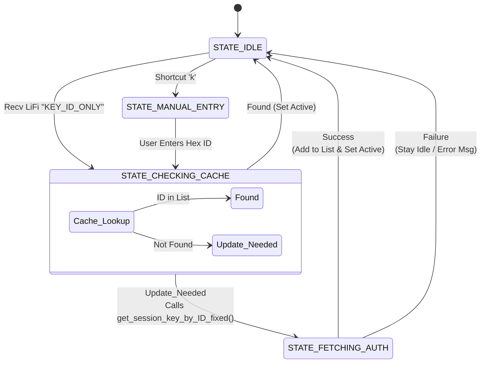

# Ask Receiver Logic

`ask_receiver.c` is designed to be the "Detective". It doesn't start with keys; it listens for LiFi signals to find out *who* is in the room and then asks the Auth Server for permission to talk to them.

