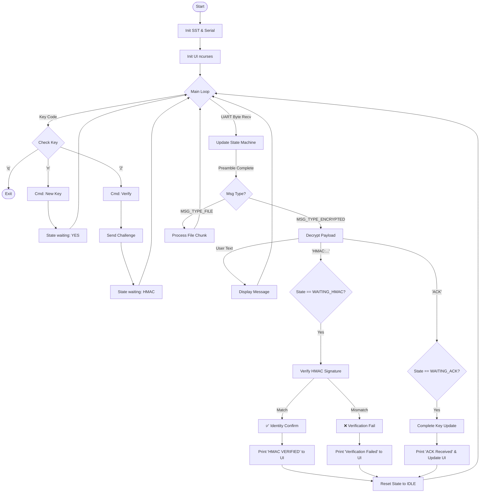

# Flash Receiver Application Logic

`flash_receiver.c` is the primary receiver application. It combines file transfer, secure chat, and authentication verification into one UI-driven tool.

## Core Responsibilities
1.  **Secure Chat/Command**: Receives encrypted text messages.
2.  **File Transfer**: Receives and decompresses files (`.txt`, `.jpg`, etc.).
3.  **Authentication**: Verifies the Sender (Pico) via HMAC Challenge-Response.
4.  **Key Management**: Requests new keys from Auth and pushes them to the Sender.

## Application Flowchart

