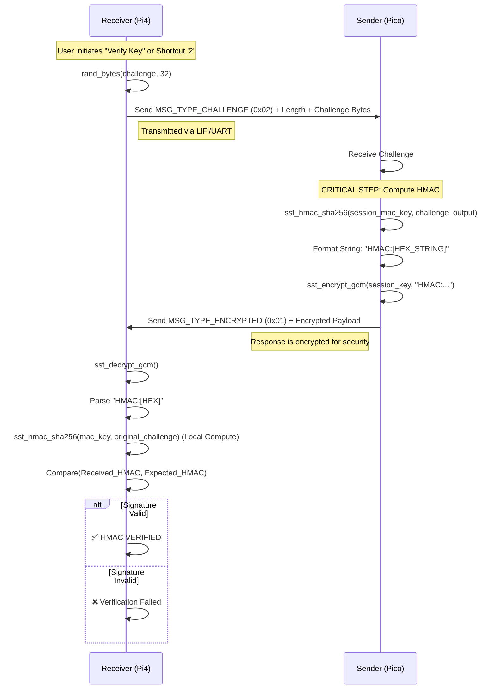

# HMAC Challenge Flow

This diagram illustrates the challenge-response authentication mechanism between the Receiver (Pi4) and the Sender (Pico).

```mermaid
sequenceDiagram
    participant Pi4 as Receiver (Pi4)
    participant Pico as Sender (Pico)

    Note over Pi4: User initiates "Verify Key" or Shortcut '2'
    Pi4->>Pi4: rand_bytes(challenge, 32)
    
    Pi4->>Pico: Send MSG_TYPE_CHALLENGE (0x02) + Length + Challenge Bytes
    Note right of Pi4: Transmitted via LiFi/UART
    
    Pico->>Pico: Receive Challenge
    
    Note over Pico: CRITICAL STEP: Compute HMAC
    Pico->>Pico: sst_hmac_sha256(session_mac_key, challenge, output)
    
    Pico->>Pico: Format String: "HMAC:[HEX_STRING]"
    Pico->>Pico: sst_encrypt_gcm(session_key, "HMAC:...")
    
    Pico->>Pi4: Send MSG_TYPE_ENCRYPTED (0x01) + Encrypted Payload
    Note left of Pico: Response is encrypted for security
    
    Pi4->>Pi4: sst_decrypt_gcm()
    Pi4->>Pi4: Parse "HMAC:[HEX]"
    
    Pi4->>Pi4: sst_hmac_sha256(mac_key, original_challenge) (Local Compute)
    Pi4->>Pi4: Compare(Received_HMAC, Expected_HMAC)
    
    alt Signature Valid
        Pi4->>Pi4: ✅ HMAC VERIFIED
    else Signature Invalid
        Pi4->>Pi4: ❌ Verification Failed
    end
```
