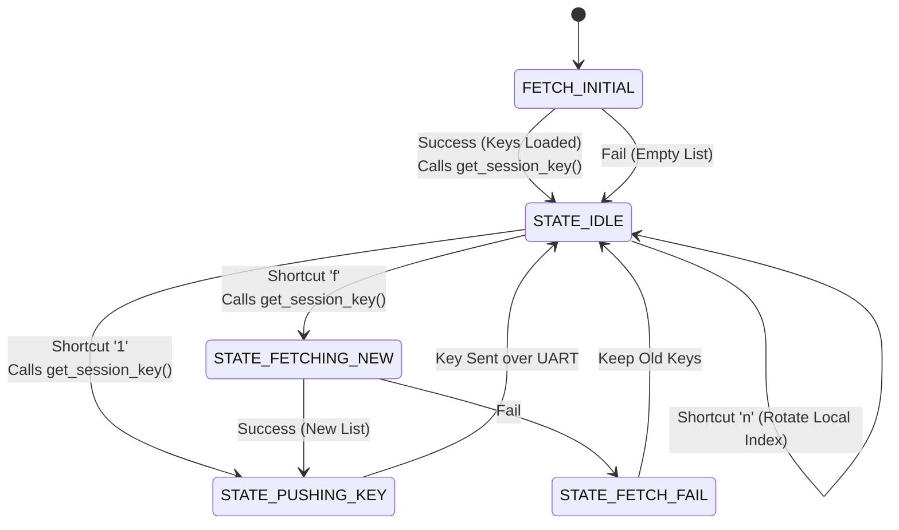

# Keys Receiver Logic

`keys_receiver.c` is the "Manager". It fetches fresh keys from the Auth Server at startup and pushes them to the Pico (Sender) so the Pico has valid credentials to broadcast.

