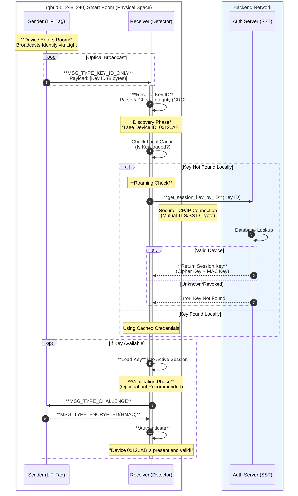

# Smart Room Communication Flow

This diagram illustrates how a LiFi-enabled device (Sender/Tag) enters a room, communicates its identity to the Detector (Receiver), and how the Detector verifies this identity with the central Authentication Service (SST).

